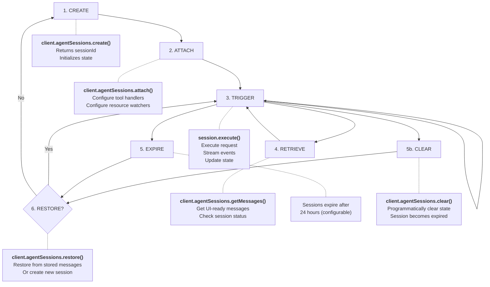

# Sessions

Sessions represent conversations with an agent. They store conversation history, track resources and variables, and enable stateful interactions.

## Creating Sessions

Create a session by specifying the agent ID and initial input variables:

```typescript
import { OctavusClient } from '@octavus/server-sdk';

const client = new OctavusClient({
  baseUrl: process.env.OCTAVUS_API_URL!,
  apiKey: process.env.OCTAVUS_API_KEY!,
});

// Create a session with the support-chat agent
const sessionId = await client.agentSessions.create('support-chat', {
  COMPANY_NAME: 'Acme Corp',
  PRODUCT_NAME: 'Widget Pro',
  USER_ID: 'user-123', // Optional inputs
});

console.log('Session created:', sessionId);
```

## Create and Trigger in One Call

`create()` followed by `attach().execute()` is two round trips, and it forces you to create the session before you know whether the user will ever send a message. `agentSessions.start()` does both in a single streaming request: it creates the session **and** runs its first trigger, so per-session configuration (model, system-prompt inputs, anything routed through session `input`) is captured at the moment of the first message, and no session is created for a conversation that never starts.

```typescript
import { toSSEStream } from '@octavus/server-sdk';

export async function POST(request: Request) {
  const { chatId, message, model } = await request.json();

  // No session exists yet. The first execute() creates it and runs the trigger.
  const session = client.agentSessions.start({
    agentId: 'support-chat',
    input: { COMPANY_NAME: 'Acme Corp', MODEL: model }, // captured now, not earlier
    idempotencyKey: chatId, // a retry resolves to the same session
    onSessionCreated: (sessionId) => {
      // Persist your own mapping so later messages attach to this session.
      void db.chats.update({ where: { id: chatId }, data: { sessionId } });
    },
  });

  const events = session.execute(
    { type: 'trigger', triggerName: 'user-message', input: { USER_MESSAGE: message } },
    { signal: request.signal },
  );

  return new Response(toSSEStream(events), {
    headers: { 'Content-Type': 'text/event-stream' },
  });
}
```

After the first trigger, the handle behaves exactly like one from `attach()` - continuations and later triggers automatically target the now-created session. Calling `execute()` with a `continue` request before the first trigger throws, since there is no session to continue yet.

### Learning the session id

The created session id reaches you through two channels:

- **`onSessionCreated(sessionId)`** - fired as soon as the id is known, before events stream. This is the ergonomic way to persist your chat-to-session mapping.
- **The first `start` event** - carries `sessionId`, which the client SDK also surfaces (see [Client SDK Overview](/docs/client-sdk/overview)). Useful when the browser needs the id, or for transports that do not expose response headers.

`getSessionId()` returns `undefined` on a deferred handle until the first trigger creates the session, then returns the id.

### Retry safety

`start()` sends a client-supplied `idempotencyKey` (auto-generated if you omit it). A transient retry of the first request resolves to the same session instead of creating a duplicate or double-counting session usage, so it is safe to retry. Using a stable, meaningful key such as your `chatId` guarantees one session per chat even across retries or double submits.

### Start Options

| Option             | Type                          | Description                                                       |
| ------------------ | ----------------------------- | ----------------------------------------------------------------- |
| `agentId`          | `string`                      | Agent to start a session for                                      |
| `input`            | `Record<string, unknown>`     | Immutable session input, captured at the first trigger            |
| `idempotencyKey`   | `string`                      | Makes a retried start resolve to the same session; auto-generated |
| `onSessionCreated` | `(sessionId: string) => void` | Called with the session id as soon as it is assigned              |

`start()` also accepts the same `tools`, `resources`, `mcpServers`, `onToolResults`, and `rejectClientToolCalls` options as `attach()`.

> The two-step `create()` + `attach()` flow is unchanged and fully supported. `start()` is additive - reach for it when you want to defer creation to the first message.

## Getting Session Messages

To restore a conversation on page load, use `getMessages()` to retrieve UI-ready messages:

```typescript
const session = await client.agentSessions.getMessages(sessionId);

console.log({
  sessionId: session.sessionId,
  agentId: session.agentId,
  messages: session.messages.length, // UIMessage[] ready for frontend
});
```

The returned messages can be passed directly to the client SDK's `initialMessages` option.

### UISessionState Interface

```typescript
interface UISessionState {
  sessionId: string;
  agentId: string;
  messages: UIMessage[]; // UI-ready conversation history
}
```

## Full Session State (Debug)

For debugging or internal use, you can retrieve the complete session state including all variables and internal message format:

```typescript
const state = await client.agentSessions.get(sessionId);

console.log({
  id: state.id,
  agentId: state.agentId,
  messages: state.messages.length, // ChatMessage[] (internal format)
  resources: state.resources,
  variables: state.variables,
  createdAt: state.createdAt,
  updatedAt: state.updatedAt,
});
```

> **Note**: Use `getMessages()` for client-facing code. The `get()` method returns internal message format that includes hidden content not intended for end users.

## Getting Execution Logs

`getLogs()` returns the chronological execution trace for a session - triggers, messages, tool calls, LLM responses, errors, and other events emitted while the agent ran. Useful for debugging, observability, and building custom timeline views.

```typescript
const result = await client.agentSessions.getLogs(sessionId);

if (result.status === 'expired') {
  console.log('Session expired:', result.sessionId);
} else {
  for (const entry of result.entries) {
    console.log(entry.type, entry.timestamp);
  }
}
```

Each entry is a typed variant of `ExecutionLogEntry` (a discriminated union) so consumers can narrow on `entry.type`:

```typescript
const result = await client.agentSessions.getLogs(sessionId);

if (result.status !== 'expired') {
  const toolCalls = result.entries.filter((e) => e.type === 'tool-call');
  for (const call of toolCalls) {
    // call.toolName, call.toolArguments are typed without optional chaining
    console.log(call.toolName, call.toolArguments);
  }
}
```

### Excluding Model Request Payloads

Model-request entries include the full provider request body and can be large. Pass `excludeModelRequests: true` to skip them:

```typescript
const result = await client.agentSessions.getLogs(sessionId, {
  excludeModelRequests: true,
});
```

### Truncation

Responses are capped at 1000 entries (most recent). When the log exceeds that cap, the response includes `total` and `truncated` so consumers can detect this:

```typescript
const result = await client.agentSessions.getLogs(sessionId);

if (result.status !== 'expired' && result.truncated) {
  console.warn(`Showing latest 1000 of ${result.total} entries`);
}
```

### Response Types

| Status    | Type                  | Description                                                                                  |
| --------- | --------------------- | -------------------------------------------------------------------------------------------- |
| `active`  | `ExecutionLogsResult` | `{ sessionId, entries, total?, truncated? }`. `total` and `truncated` are present when known |
| `expired` | `ExpiredSessionState` | `{ sessionId, agentId, status: 'expired', createdAt }`                                       |

> **Forward-compatible types**: `ExecutionLogEntry` may gain new variants over time. Include a `default` case when switching on `entry.type` so unknown variants are handled gracefully.

## Attaching to Sessions

To trigger actions on a session, you need to attach to it first:

```typescript
const session = client.agentSessions.attach(sessionId, {
  tools: {
    // Tool handlers (see Tools documentation)
  },
  resources: [
    // Resource watchers (optional)
  ],
});
```

### Attach Options

| Option                  | Type                              | Description                                                                     |
| ----------------------- | --------------------------------- | ------------------------------------------------------------------------------- |
| `tools`                 | `ToolHandlers`                    | Server-side tool handler functions                                              |
| `resources`             | `Resource[]`                      | Resource watchers for real-time updates                                         |
| `onToolResults`         | `(results: ToolResult[]) => void` | Callback invoked after server-side tool results are produced                    |
| `rejectClientToolCalls` | `boolean`                         | If `true`, reject tool calls that have no server handler (no client forwarding) |

For MCP tool integration (browser, filesystem, shell via `@octavus/computer`), register dynamic tools after attaching with `session.setDynamicTools()`. See [Computer](/docs/server-sdk/computer) for details.

## Executing Requests

Once attached, execute requests on the session using `execute()`:

```typescript
import { toSSEStream } from '@octavus/server-sdk';

// execute() handles both triggers and client tool continuations
const events = session.execute(
  { type: 'trigger', triggerName: 'user-message', input: { USER_MESSAGE: 'Hello!' } },
  { signal: request.signal },
);

// Convert to SSE stream for HTTP responses
return new Response(toSSEStream(events), {
  headers: { 'Content-Type': 'text/event-stream' },
});
```

### Request Types

The `execute()` method accepts a discriminated union:

```typescript
type SessionRequest = TriggerRequest | ContinueRequest;

// Start a new conversation turn
interface TriggerRequest {
  type: 'trigger';
  triggerName: string;
  input?: Record<string, unknown>;
  rollbackAfterMessageId?: string | null; // For retry: truncate messages after this ID
  sender?: UIMessageSender; // Author of this turn, for multi-user attribution
}

// Continue after client-side tool handling
interface ContinueRequest {
  type: 'continue';
  executionId: string;
  toolResults: ToolResult[];
}
```

This makes it easy to pass requests through from the client:

```typescript
// Simple passthrough from HTTP request body
export async function POST(request: Request) {
  const body = await request.json();
  const { sessionId, ...payload } = body;

  const session = client.agentSessions.attach(sessionId, {
    tools: {
      /* ... */
    },
  });
  const events = session.execute(payload, { signal: request.signal });

  return new Response(toSSEStream(events));
}
```

### Attributing Messages in Multi-User Chats

When several people share one conversation, set `sender` on the trigger so each user message is attributed to its author. Set it **server-side from your authenticated user** - never trust a client-supplied identity:

```typescript
interface UIMessageSender {
  id?: string;
  name?: string;
  image?: string; // Avatar URL
}

export async function POST(request: Request) {
  const user = await authenticate(request); // your auth
  const { sessionId, ...payload } = await request.json();

  const session = client.agentSessions.attach(sessionId, {
    tools: {
      /* ... */
    },
  });
  const events = session.execute(
    {
      ...payload,
      sender: { id: user.id, name: user.name, image: user.avatarUrl },
    },
    { signal: request.signal },
  );

  return new Response(toSSEStream(events));
}
```

The runtime stamps the sender onto the user message it creates, so it comes back on `UIMessage.sender` from `getMessages()` and survives restore. `sender` is turn metadata - it is never added to your protocol's trigger `input`, and agent-initiated turns (no `sender`) stay unattributed. For instant optimistic display in the browser, also pass it on the client `send()` (see [Client SDK Messages](/docs/client-sdk/messages)).

### Stop Support

Pass an abort signal to allow clients to stop generation:

```typescript
const events = session.execute(request, {
  signal: request.signal, // Forward the client's abort signal
});
```

When the client aborts the request, the signal propagates through to the LLM provider, stopping generation immediately. Any partial content is preserved.

## WebSocket Handling

For WebSocket integrations, use `handleSocketMessage()` which manages abort controller lifecycle internally:

```typescript
import type { SocketMessage } from '@octavus/server-sdk';

// In your socket handler
conn.on('data', async (rawData: string) => {
  const msg = JSON.parse(rawData);

  if (msg.type === 'trigger' || msg.type === 'continue' || msg.type === 'stop') {
    await session.handleSocketMessage(msg as SocketMessage, {
      onEvent: (event) => conn.write(JSON.stringify(event)),
      onFinish: async () => {
        // Fetch and persist messages to your database for restoration
      },
    });
  }
});
```

The `handleSocketMessage()` method:

- Handles `trigger`, `continue`, and `stop` messages
- Automatically aborts previous requests when a new one arrives
- Streams events via the `onEvent` callback
- Calls `onFinish` after streaming completes (not called if aborted)

See [Socket Chat Example](/docs/examples/socket-chat) for a complete implementation.

## Session Lifecycle



## Session Expiration

Sessions expire after a period of inactivity (default: 24 hours). When you call `getMessages()` or `get()`, the response includes a `status` field:

```typescript
const result = await client.agentSessions.getMessages(sessionId);

if (result.status === 'expired') {
  // Session has expired - restore or create new
  console.log('Session expired:', result.sessionId);
} else {
  // Session is active
  console.log('Messages:', result.messages.length);
}
```

### Response Types

| Status    | Type                  | Description                                                   |
| --------- | --------------------- | ------------------------------------------------------------- |
| `active`  | `UISessionState`      | Session is active, includes `messages` array                  |
| `expired` | `ExpiredSessionState` | Session expired, includes `sessionId`, `agentId`, `createdAt` |

## Persisting Chat History

To enable session restoration, store the chat messages in your own database after each interaction:

```typescript
// After each trigger completes, save messages
const result = await client.agentSessions.getMessages(sessionId);

if (result.status === 'active') {
  // Store in your database
  await db.chats.update({
    where: { id: chatId },
    data: {
      sessionId: result.sessionId,
      messages: result.messages, // Store UIMessage[] as JSON
    },
  });
}
```

> **Best Practice**: Store the full `UIMessage[]` array. This preserves all message parts (text, tool calls, files, etc.) needed for accurate restoration.

## Restoring Sessions

When a user returns to your app:

```typescript
// 1. Load stored data from your database
const chat = await db.chats.findUnique({ where: { id: chatId } });

// 2. Check if session is still active
const result = await client.agentSessions.getMessages(chat.sessionId);

if (result.status === 'active') {
  // Session is active - use it directly
  return {
    sessionId: result.sessionId,
    messages: result.messages,
  };
}

// 3. Session expired - restore from stored messages
if (chat.messages && chat.messages.length > 0) {
  const restored = await client.agentSessions.restore(
    chat.sessionId,
    chat.messages,
    { COMPANY_NAME: 'Acme Corp' }, // Optional: same input as create()
  );

  if (restored.restored) {
    // Session restored successfully
    return {
      sessionId: restored.sessionId,
      messages: chat.messages,
    };
  }
}

// 4. Cannot restore - create new session
const newSessionId = await client.agentSessions.create('support-chat', {
  COMPANY_NAME: 'Acme Corp',
});

return {
  sessionId: newSessionId,
  messages: [],
};
```

### Restore Response

```typescript
interface RestoreSessionResult {
  sessionId: string;
  restored: boolean; // true if restored, false if session was already active
}
```

## Complete Example

Here's a complete session management flow:

```typescript
import { OctavusClient } from '@octavus/server-sdk';

const client = new OctavusClient({
  baseUrl: process.env.OCTAVUS_API_URL!,
  apiKey: process.env.OCTAVUS_API_KEY!,
});

async function getOrCreateSession(chatId: string, agentId: string, input: Record<string, unknown>) {
  // Load existing chat data
  const chat = await db.chats.findUnique({ where: { id: chatId } });

  if (chat?.sessionId) {
    // Check session status
    const result = await client.agentSessions.getMessages(chat.sessionId);

    if (result.status === 'active') {
      return { sessionId: result.sessionId, messages: result.messages };
    }

    // Try to restore expired session
    if (chat.messages?.length > 0) {
      const restored = await client.agentSessions.restore(chat.sessionId, chat.messages, input);
      if (restored.restored) {
        return { sessionId: restored.sessionId, messages: chat.messages };
      }
    }
  }

  // Create new session
  const sessionId = await client.agentSessions.create(agentId, input);

  // Save to database
  await db.chats.upsert({
    where: { id: chatId },
    create: { id: chatId, sessionId, messages: [] },
    update: { sessionId, messages: [] },
  });

  return { sessionId, messages: [] };
}
```

## Clearing Sessions

To programmatically clear a session's state (e.g., for testing reset/restore flows), use `clear()`:

```typescript
const result = await client.agentSessions.clear(sessionId);
console.log(result.cleared); // true
```

After clearing, the session transitions to `expired` status. You can then restore it with `restore()` or create a new session.

```typescript
interface ClearSessionResult {
  sessionId: string;
  cleared: boolean;
}
```

This is idempotent - calling `clear()` on an already expired session succeeds without error.

## Error Handling

```typescript
import { ApiError } from '@octavus/server-sdk';

try {
  const session = await client.agentSessions.getMessages(sessionId);
} catch (error) {
  if (error instanceof ApiError) {
    if (error.status === 404) {
      // Session not found or expired
      console.log('Session expired, create a new one');
    } else {
      console.error('API Error:', error.message);
    }
  }
  throw error;
}
```
