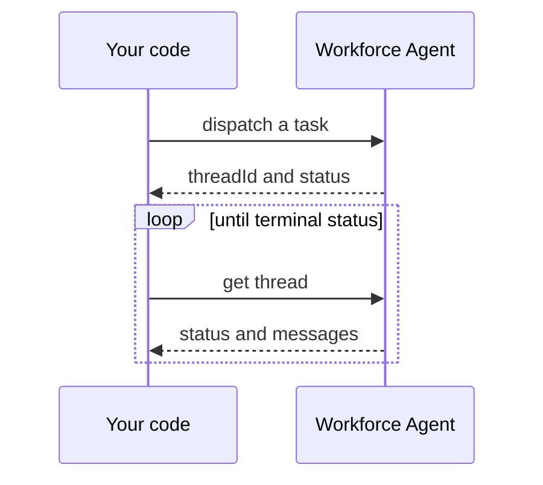

# Workforce Agents

Workforce Agents are Octavus's autonomous AI teammates - specialized agents you hire and configure in the dashboard, each with its own computer, skills, and tools. Browse and hire them at [octavus.ai/agents](https://octavus.ai/agents), and see the full roster at [octavus.ai/agents/discover](https://octavus.ai/agents/discover).

The **Workforce Agents API** lets you drive one of your agents without a browser: give it a task, wait for it to finish, and read what it did. It is built for automation - CI pipelines, scheduled jobs, and backend integrations that hand work to an agent and collect the result.

> Workforce Agents are distinct from agents you build yourself with the SDK. The [Sessions API](/docs/api-reference/sessions) drives agents you define and host; the Workforce Agents API drives the managed agents you hire and configure in the dashboard.

## How it works

A run follows a simple dispatch-then-poll model - there is no stream or webhook to manage:

1. **Dispatch** a message to an agent. This starts a **thread** (a conversation) and returns a `threadId` right away.
2. **Poll** the thread until its `status` is terminal.
3. **Read** the thread's messages to get the agent's work.

### Thread status

| Status      | Meaning                                                                             |
| ----------- | ----------------------------------------------------------------------------------- |
| `pending`   | Dispatched, waiting to start                                                        |
| `queued`    | Waiting for the agent to free up - an agent runs one task at a time on its computer |
| `running`   | The agent is working                                                                |
| `completed` | Finished successfully (terminal)                                                    |
| `failed`    | Ended with an error - see `failureReason` (terminal)                                |
| `cancelled` | Stopped (terminal)                                                                  |

Poll while the status is `pending`, `queued`, or `running`, and stop once it is `completed`, `failed`, or `cancelled`.

## Authentication

Each agent has its own **API key**, created from the agent's settings in the dashboard (Settings -> API). The key:

- Drives only that one agent - a key for one agent can never call another.
- Is a secret. Use it from a backend, script, or CI, never in a browser or client app.
- Is sent as a bearer token: `Authorization: Bearer oct_agt_...`.

Create a key, copy it once (it is shown only at creation), and store it securely.

## Next steps

- [Using the SDK](/docs/workforce-agents/sdk) - the `@octavus/server-sdk` `workforce` client, including a run-and-wait helper.
- [API reference](/docs/workforce-agents/api-reference) - the REST endpoints, for any language.
