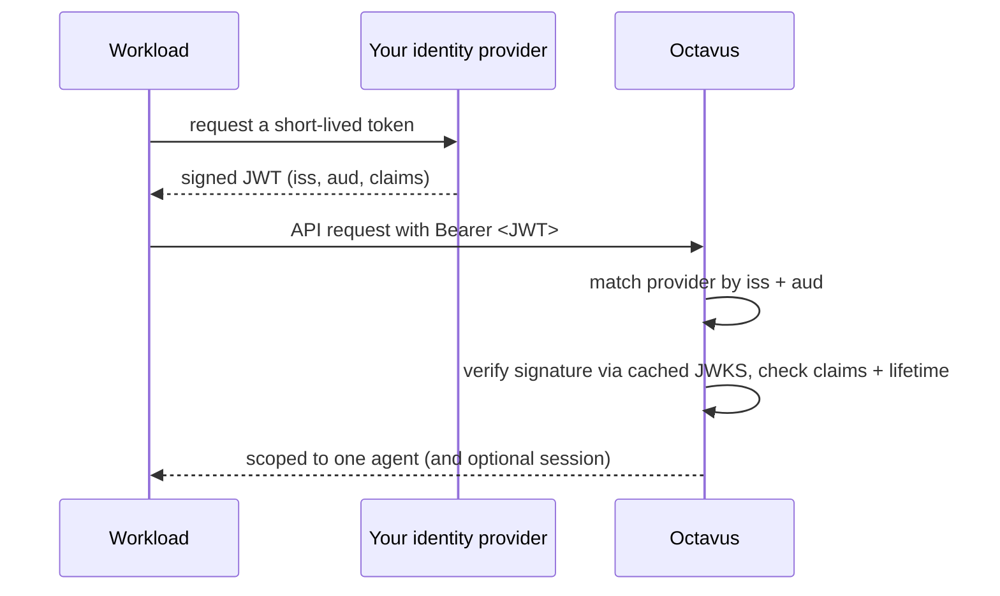

# Workload Identity Federation

Federation lets a workload present a token that **your own** identity provider signs. Octavus verifies it against a provider you register - checking the signature, issuer, audience, expiry, and your claim conditions - and maps it to a scoped, session-use principal. There is no Octavus-held secret and no call back to Octavus at request time: after the first fetch of your provider's public keys, verification is fully offline.

This is the same OIDC pattern used by AWS, Google Cloud, and GitHub Actions, so you can reuse an existing identity provider and standard libraries.



## Register a provider

In the dashboard, open your project's **Settings -> Federation** and register a provider:

- **Issuer** - your provider's OIDC issuer URL (HTTPS). Octavus discovers its JWKS from the issuer automatically, or you can set an explicit JWKS URL.
- **Allowed algorithms** - the asymmetric algorithms your provider signs with (e.g. `RS256`, `ES256`).
- **Claim conditions** - required claim matches, so only your intended workloads are trusted (for example `sub` equals a specific value, or a `repository` claim starts with your org).
- **Agent scope** - either bind every token to one fixed agent, or read the agent id from a token claim.
- **Session scope (optional)** - read a session id from a claim to produce the tightest, single-session credential.
- **Max token lifetime** - Octavus rejects any token whose lifetime exceeds this (or the platform maximum of 12 hours), so a valid signature can never be long-lived.

On registration Octavus generates a unique **audience** value. Copy it - your tokens must set it as their `aud` claim. It uniquely identifies your registration and prevents a token minted for another party from being replayed against Octavus.

## Sign tokens

Your provider signs a short-lived JWT for each workload with:

- `iss` - exactly your registered issuer.
- `aud` - the audience Octavus generated for your registration.
- `exp` / `iat` - a short lifetime, within your configured maximum.
- The claims your conditions require (for example a specific `sub`).
- If you scope by claim, the agent id (and optional session id) in the configured claims.

## Present a token

Send the JWT as the Bearer token on any session request. With the SDK, pass a **token provider** so the current token is used on every request (and refreshed as it rotates):

```typescript
import { OctavusClient } from '@octavus/server-sdk';

const client = new OctavusClient({
  baseUrl: 'https://octavus.ai',
  // Called per request - return the workload's current federated token.
  apiKey: async () => await getWorkloadIdentityToken(),
});

await client.agentSessions.start(/* ... */);
```

## Revoke

Because federated tokens are verified statelessly, revocation is layered:

- **Short lifetimes** are the always-on bound.
- **Disable or delete the provider** in the dashboard to invalidate every token from it immediately - the kill switch, since verification looks the provider up on each request.

## How it stays secure

Octavus pins verification to your provider's allowed algorithms (rejecting `alg: none`), requires an exact issuer and audience match, enforces expiry and not-before with a small clock-skew tolerance, applies your claim conditions, and caps the honored lifetime. Issuers must be HTTPS, and key discovery is hardened against server-side request forgery.
